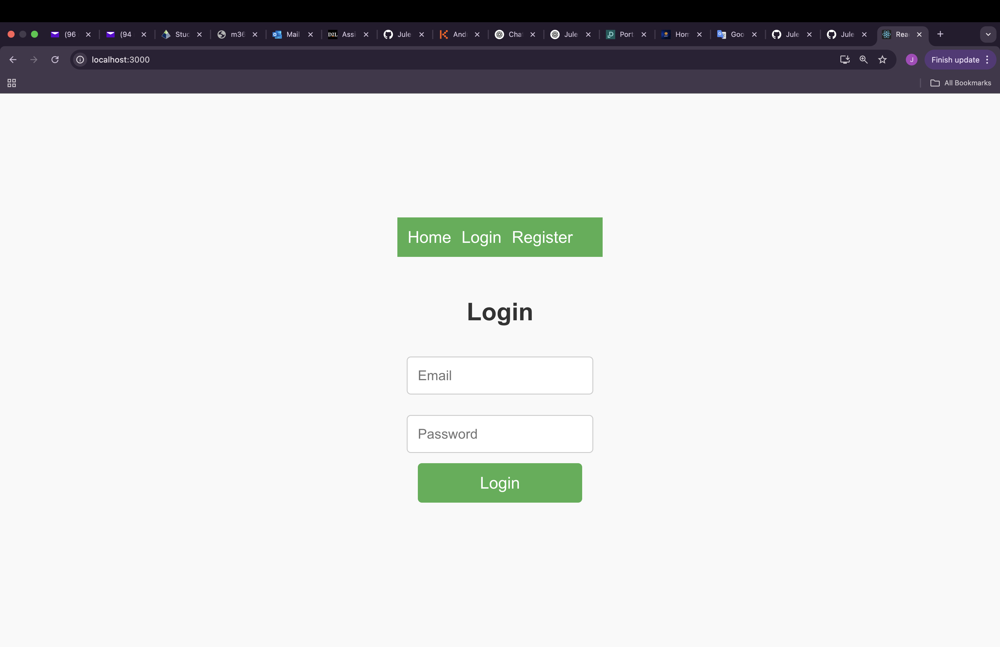
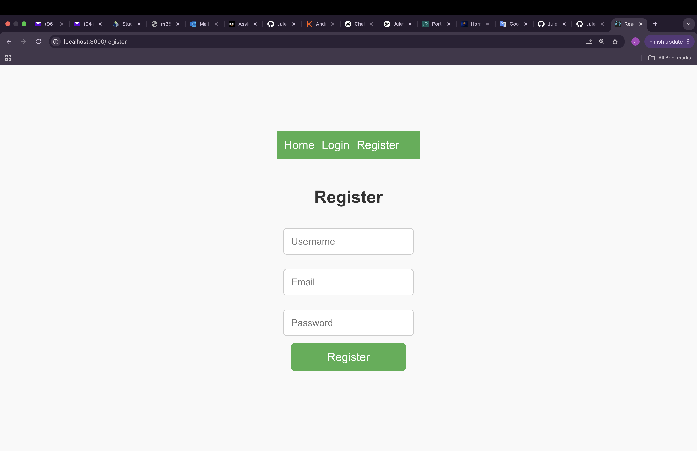
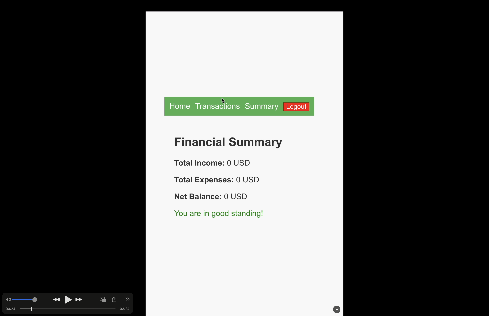
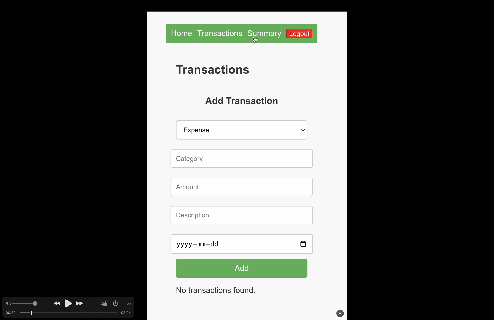
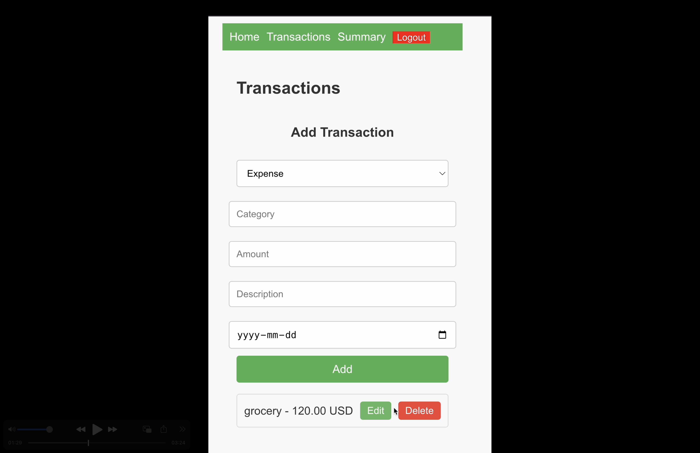

# 💰 FintrackApp

**FintrackApp** is a simple and intuitive financial tracker web application built with **React.js** and connected to a **MySQL** database using **PHP** as the backend (API). It allows users to register, log in, add financial transactions (income/expenses), and view summaries of their financial status.

---

## 📸 Screenshots

| Login | Register | Summary |
|-------|----------|---------|
|  |  |  |

| Add Transaction | Transactions List | MySQL Database |
|------------------|------------------|----------------|
|  |  |  |

---

## ✨ Features

- User authentication (Registration/Login)
- Add, update, and delete financial transactions
- Display transaction history
- Calculate and show total income, expenses, and net balance
- Visual financial summary
- Simple and clean responsive UI

---

## 🚀 Tech Stack

- **Frontend:** React.js, JavaScript, CSS
- **Backend:** PHP (REST APIs)
- **Database:** MySQL
- **Server Environment:** XAMPP / Apache (PHP server)
- **Tooling:** phpMyAdmin, npm

---

## 🛠️ How to Run Locally

### 1. Clone the repository
```bash
git clone https://github.com/Jules1Siani/fintrackApp.git
```

### 2. Frontend Setup
```bash
cd fintrackApp/fintrack
npm install
npm start
```
Open [http://localhost:3000](http://localhost:3000) in your browser.

### 3. Backend Setup (PHP Server)

- Install [XAMPP](https://www.apachefriends.org/index.html)
- Start **Apache** from XAMPP Control Panel
- Move the folder `finTrack_server` into your `htdocs/` directory
- Import `fintrack_db.sql` into **phpMyAdmin** to create the database

#### MySQL Credentials (default)
```php
host: localhost
user: root
password: 
database: fintrack_db
```

---

## 📂 Folder Structure

```
fintrackApp/
├── fintrack/              # React frontend
├── finTrack_server/       # PHP backend API
│   ├── api/               # PHP API endpoints
│   └── config/            # DB config files
├── fintrack_db.sql        # Database structure (import via phpMyAdmin)
└── Screenshots/           # UI and DB screenshots
```

---
## 🎬 Demo Video

🎥 [Watch the demo video](./Screenshots/fintrack-demo.mov)
---

## 📌 Author

**Jules Mickael Siani**  
GitHub: [Jules1Siani](https://github.com/Jules1Siani)

---

## 📜 License

This project is open source and available under the [MIT License](./LICENSE).
